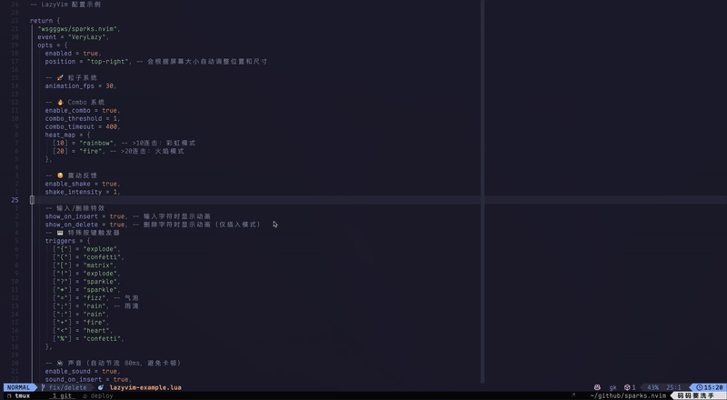

# Sparks.nvim

The most satisfying typing effects plugin for Neovim.

🔥 **Particle Physics Engine** | **Combo System** | **Immersive Sound** | **Smart Colors**

> "Coding has never been this addictive!"

<div align="center">
  
</div>

[中文文档](README.md)

## ✨ Features

- **⚛️ Physics Particle System**: Real-time simulation with gravity and drag.
  No boring pre-rendered animations.
- **🔥 Combo System**:
  - Accumulate heat with continuous typing to trigger `x10` combo counters.
  - **Heat Modes**: The higher the combo, the cooler the effects
    (`Rainbow 🌈` -> `Fire 🔥`).
- **🎨 Smart Coloring**: Automatically extracts colors from Treesitter to match
  your code's highlighting.
- **💥 Screen Shake**: Optional screen shake on high-combo moments or deletions
  for extra impact.
- **📱 Adaptive Layout**:
  - Automatically adjusts animation window size based on window dimensions
  - Real-time response to window resize events with auto-repositioning
  - Animation window follows the current editor window
- **🎭 Diverse Effects**:
  - `confetti` (Default)
  - `explode` (On delete)
  - `matrix` (The Matrix style green rain)
  - `snow` (Gentle falling snow)
  - `rain` (Vertical rain drops)
  - `fizz` (Bubbling up)
  - `fire` (Rising flames)
  - `heart` (Floating love hearts ♥)
  - `sparkle` (Twinkling stars ✦)
- **🔊 Immersive Sound**:
  - Switch sound packs instantly (`default`, `mechanical`, `sci-fi`)
  - Smart throttling (80ms) prevents lag during rapid typing
  - **macOS Optimization**: Uses `afplay` with playback rate acceleration (2.5x+) for crisp, mechanical-like feedback.
- **⚡ Extreme Performance**:
  - **✨ Visual Fading**: Particles shrink and fade out naturally.
  - **🛡️ Smart Exclude**: Disabled in Telescope, NvimTree, etc.
  - **Note**: Fully async rendering, zero blocking.

## 📦 Installation

### LazyVim / lazy.nvim

```lua
{
  "wsgggws/sparks.nvim",
  event = "VeryLazy",
  opts = {
    -- 🚀 All best configs enabled by default
  },
}
```

## ⚙️ Configuration

```lua
require("sparks").setup({
  -- Basic
  enabled = true,
  position = "top-right", -- Auto-adjusts based on screen size

  -- 🚀 Physics
  animation_fps = 30,     -- (Recommend 30-60)
  default_effect = { "confetti", "sparkle", "snow", "rain", "fizz" }, -- Default effect for non-triggered keys (supports array for random)

  -- 🔥 Combo
  enable_combo = true,
  combo_threshold = 1,    -- Start counter from 1st keystroke
  combo_timeout = 400,    -- Reset after 400ms idle

  -- Heat Map: Combo -> Mode
  heat_map = {
    [10] = "rainbow", -- >10: Rainbow particles
    [20] = "fire",    -- >20: Rising fire
  },

  -- 🫨 Impact
  enable_shake = true,    -- Screen shake on big combos

  -- Insert/Delete effects
  show_on_insert = true,  -- Show animation on character input
  show_on_delete = true,  -- Show animation on delete (insert mode only)

  -- Effects: confetti, explode, matrix, snow, rain, fizz, fire, heart, sparkle

  -- ⌨️ Triggers (Key -> Effect)
  triggers = {
    ["{"] = "explode",
    ["("] = "confetti",
    ["["] = "matrix",    -- Matrix
    ["!"] = "explode",   -- Explode
    ["?"] = "sparkle",   -- Sparkle
    ["="] = "fizz",      -- Fizz
    [";"] = "rain",      -- Rain
    [":"] = "rain",      -- Rain
    ["+"] = "fire",      -- Fire
    ["<"] = "heart",     -- Heart
    ["%"] = "confetti",  -- Confetti
  },

  -- 🔊 Sound
  enable_sound = true,
  sound_on_insert = true, -- Play sound on insert
  sound_on_delete = true, -- Play sound on delete
  sound_volume = 5.0,     -- Volume (0.0 - 5.0)
  sound_volume = 3.0,     -- (0.0 - 5.0)
  sound_pack = "default", -- default, mechanical, sci-fi
  -- Sound auto-throttles (50ms) to prevent lag

  -- 🛡️ Smart Exclude
  excluded_filetypes = {
    "TelescopePrompt",
    "NvimTree",
    "neo-tree",
    "lazy",
    "mason",
  },
  excluded_buftypes = { "nofile", "terminal", "prompt" },

  -- Performance
  throttle = 100,         -- Throttle time (ms)
  ignore_paste = true,    -- Disable in paste mode
  disable_on_macro = true,-- Disable during macro recording/execution

  -- Appearance
  winblend = 0,           -- Transparency (0-100). Try 10-20 if float blocks cursorline
})
```

## 🎮 Commands

- `:SparksToggle` - Toggle plugin
- `:SparksTest` - Test animation effects
- `:checkhealth sparks` - Diagnose configuration

## 🔊 Sound Support

- **macOS**: `afplay`
- **Linux**: `paplay` (PulseAudio), `aplay` (ALSA)
- **Windows**: PowerShell SoundPlayer

## 📄 License

MIT
