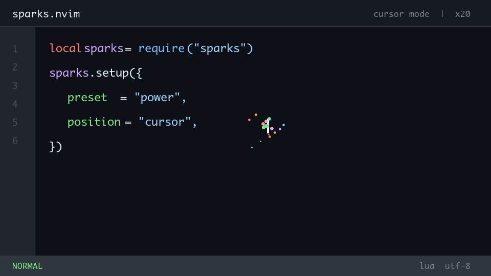

# sparks.nvim

[](https://github.com/wsgggws/sparks.nvim/actions/workflows/ci.yml)
[](https://neovim.io/)
[](LICENSE)

Physics-based typing feedback for Neovim. Particles can stay at the right edge or follow
the cursor, inherit syntax colors, build combos, and celebrate editor events without blocking input.

[简体中文](README.zh-CN.md)



## Highlights

- Fixed right-center feedback by default, with right-top, right-bottom, and cursor-local options.
- Transparent cursor overlays leave the code beneath empty particle cells readable.
- Four tuned presets: `subtle`, `power`, `zen`, and `streamer`.
- Unicode-safe rendering for CJK text, symbols, and emoji.
- Public `emit()` and `register_effect()` interfaces for plugin integrations.
- Optional feedback for saves, cleared diagnostics, and test-success user events.
- Treesitter-aware colors, combos, heat levels, and optional screen shake.
- Bounded particle count, adaptive overlay size, and a self-stopping render loop.
- Optional cross-platform sound playback. Sound is disabled by default.

## Requirements

- Neovim 0.10 or newer.
- A Treesitter parser is optional; fallback highlight groups are used without one.
- Sound optionally uses `afplay`, `paplay`, `aplay`, `ffplay`, PowerShell, or
  `canberra-gtk-play`.

## Installation

With lazy.nvim:

```lua
{
  "wsgggws/sparks.nvim",
  event = "VeryLazy",
  opts = {
    preset = "power",
  },
}
```

With the built-in package loader or another manager:

```lua
require("sparks").setup()
```

## Presets

| Preset | Character | FPS | Particle budget | Delete feedback | Shake |
| --- | --- | ---: | ---: | --- | --- |
| `subtle` | Restrained sparkle | 24 | 80 | Off | Off |
| `power` | Balanced and punchy | 30 | 180 | On | On |
| `zen` | Slow snow and fizz | 20 | 60 | Off | Off |
| `streamer` | High-energy recording mode | 60 | 400 | On | On |

Explicit options override the selected preset:

```lua
require("sparks").setup({
  preset = "subtle",
  position = "cursor",
  render = {
    radius = 5,
    avoid_completion_menu = true,
    transparent = true,
    show_text = false,
    combo_position = "top",
    safe_radius = { x = 1, y = 0 },
    offset = { x = 2, y = 1 },
  },
  max_particles = 100,
})
```

Run `:SparksPreview` to cycle through every installed effect.

## Configuration

These commonly used options are part of the stable v1 configuration interface. A
preset is applied first, then explicit values override it. See `:help sparks-config`
for the complete reference.

```lua
require("sparks").setup({
  enabled = true,
  preset = "power",
  position = "right-center", -- "top-right", "right-center", "bottom-right", or "cursor"
  duration = 1200,
  throttle = 30,
  border = "none",
  animation_fps = 30,
  max_particles = 180,
  particle_multiplier = 1,
  default_effect = { "confetti", "sparkle", "snow", "rain", "fizz" },

  render = {
    radius = 6,
    avoid_completion_menu = true,
    transparent = false, -- Fixed default; cursor placement defaults to true
    show_text = true, -- Fixed default; cursor placement defaults to false
    combo_position = "center", -- Cursor placement defaults to "top"; "none" hides it
    safe_radius = { x = 1, y = 0 }, -- Cursor mode only
    offset = { x = 2, y = 1 }, -- Cursor mode only
  },

  show_on_insert = true,
  show_on_delete = true,
  enable_combo = true,
  combo_threshold = 1,
  combo_timeout = 400,
  heat_map = {
    [10] = "rainbow",
    [20] = "fire",
  },
  enable_shake = true,
  shake_intensity = 1,

  triggers = {
    ["{"] = "explode",
    ["["] = "matrix",
    ["?"] = "sparkle",
    ["+"] = "fire",
    ["<"] = "heart",
  },

  enable_sound = false,
  sound_pack = "default", -- "default" or "none"
  sound_volume = 1,
  sound_on_insert = true,
  sound_on_delete = true,
  sound_file_insert = nil, -- String or list of paths
  sound_file_delete = nil,

  ignore_paste = true,
  disable_on_macro = true,
  excluded_filetypes = { "TelescopePrompt", "NvimTree", "neo-tree", "lazy", "mason", "dashboard" },
  excluded_buftypes = { "nofile", "terminal", "prompt" },
  winblend = 0, -- Used by fixed positions, or when render.transparent is false

  integrations = {
    save = { enabled = false, effect = "sparkle", intensity = 1 },
    diagnostics_clear = { enabled = false, effect = "confetti", intensity = 2 },
    test_success = {
      enabled = false,
      effect = "fire",
      intensity = 3,
      user_events = { "SparksTestSuccess" },
    },
  },
})
```

`position` is the primary placement option. Fixed positions use an opaque overlay, show event
text, center the combo, and honor `winblend`. `position = "cursor"` enables a transparent
overlay, hides repeated input text, moves the combo to the top, and protects three cells on
the cursor row. `render.offset` affects cursor placement only; positive `x` moves right and
positive `y` moves down. The legacy `render.mode = "cursor" | "corner"` interface remains
accepted, but new configurations should use `position`. Mode-specific defaults are selected
only when the corresponding render field is omitted; explicit render values always win.

Per-effect palettes accept Neovim highlight group names:

```lua
require("sparks").setup({
  particle_colors = {
    confetti = { "DiagnosticOk", "DiagnosticInfo", "DiagnosticWarn" },
    fire = { "DiagnosticWarn", "DiagnosticError" },
  },
})
```

## Public Interface

Emit feedback from another plugin or your own mapping:

```lua
local sparks = require("sparks")

local accepted, reason = sparks.emit({
  effect = "confetti",
  text = "PASS",
  intensity = 2,
  force = true,     -- Ignore filetype/buftype exclusions
  throttle = false, -- Ignore the input throttle for this event
})
```

`emit()` returns `true` when accepted. A rejected event returns `false` and one of
`"disabled"`, `"excluded"`, `"throttled"`, or `"unknown_effect"`.

Register a data-driven effect:

```lua
require("sparks").register_effect("comet", {
  chars = { "*", ".", "+" },
  count = 8,
  life = { 20, 35 },
  gravity = 0.04,
  drag = 0.98,
  velocity = function(context)
    return (math.random() - 0.5) * 1.8, -0.8
  end,
})
```

Built-in effects are `confetti`, `explode`, `fire`, `fizz`, `heart`, `matrix`,
`rain`, `snow`, and `sparkle`. The legacy personalized effects remain available
for compatibility.

## Integrations

Save and diagnostics integrations work through Neovim autocmds. Test runners vary,
so test success uses `User` events. To celebrate any runner, emit the configured
event after a successful run:

```lua
vim.api.nvim_exec_autocmds("User", { pattern = "SparksTestSuccess" })
```

Runner integrations can fire that event after a successful result. They can also call
`require("sparks").emit()` directly when they need custom text or intensity.

## Commands

- `:SparksToggle` enables or disables all feedback and immediately closes the overlay.
- `:SparksTest` and `:SparksPreview` cycle through registered effects.
- `:checkhealth sparks` checks compatibility, sound, colors, and render budget.

See `:help sparks` for the complete reference.

## Performance

The render loop exists only while feedback is visible. Particle count is bounded by
`max_particles`; cursor colors are cached; namespace allocation and shell invocation
are kept out of the frame loop. Run the public-interface benchmark with:

```sh
make benchmark
```

Set `SPARKS_BENCH_MAX_MS` in CI when a machine-specific regression budget is useful.
The recorded methodology and baseline are in [BENCHMARKS.md](BENCHMARKS.md).

## Development

```sh
make test
make lint
make benchmark
make demo
```

Preset and effect contributions are welcome. See [CONTRIBUTING.md](CONTRIBUTING.md)
and [CHANGELOG.md](CHANGELOG.md).

## License

MIT
